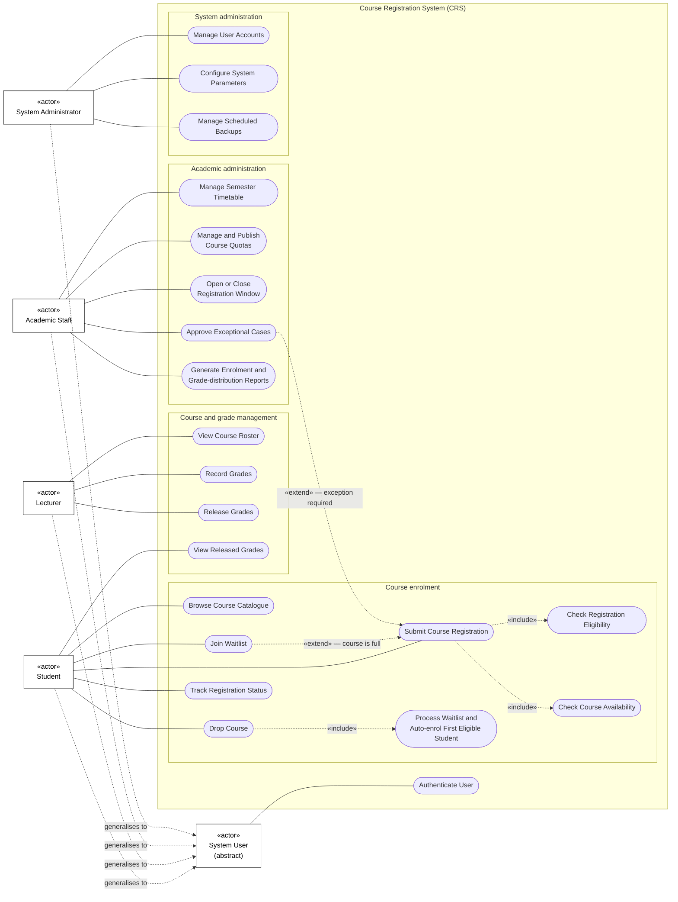

# Question 2: Use Case Analysis and UML Use Case Diagram

## A. English Version

### 1. Actors, goals, and classifications

All actors are placed **outside** the Course Registration System boundary because an actor represents an external role that interacts with the system.

| Actor | Primary goal | Classification |
|---|---|---|
| **Student** | Browse available courses, submit or withdraw registrations, join waitlists, and track registration results and released grades. | **Primary actor** |
| **Lecturer** | Manage the students and grades of the courses assigned to them. | **Primary actor** |
| **Academic Staff** | Administer semesters, timetables, quotas, registration periods, exceptional cases, and academic reports. | **Primary actor** |
| **System Administrator** | Maintain the technical operation of the CRS by managing accounts, configuration, and backups. | **Secondary/supporting actor** |

> **Classification note:** A System Administrator initiates technical-administration use cases and is therefore a primary actor with respect to those individual use cases. At the overall business-system level, however, the role is commonly classified as a secondary/supporting actor because it supports the operation of the CRS rather than pursuing its core course-registration goals.

### 2. CRS use cases

| No. | Use case | Initiating actor(s) | One-sentence goal description |
|---:|---|---|---|
| 1 | **Authenticate User** | All actors | Verify the user's identity before granting access to protected CRS functions and data. |
| 2 | **Browse Course Catalogue** | Student | Search for and view courses offered in the current semester. |
| 3 | **Submit Course Registration** | Student | Submit a request to enrol in a selected course. |
| 4 | **Check Registration Eligibility** | Student, indirectly through registration | Check prerequisites, timetable conflicts, and other eligibility rules before accepting a registration. |
| 5 | **Check Course Availability** | Student, indirectly through registration | Determine whether the selected course has a place available under its published quota. |
| 6 | **Join Waitlist** | Student | Join the electronic queue when an eligible course registration cannot be completed because the course is full. |
| 7 | **Drop Course** | Student | Withdraw from a course in which the student is currently enrolled. |
| 8 | **Track Registration Status** | Student | View the current status of each registration request, such as pending, approved, enrolled, waitlisted, or rejected. |
| 9 | **View Released Grades** | Student | View course grades after the lecturer has released them. |
| 10 | **View Course Roster** | Lecturer | View the currently enrolled students in a course assigned to the lecturer. |
| 11 | **Record Grades** | Lecturer | Enter or update students' midterm and final grades. |
| 12 | **Release Grades** | Lecturer | Publish recorded grades to students after the grading period closes. |
| 13 | **Manage Semester Timetable** | Academic Staff | Define and publish course offerings and their semester schedules. |
| 14 | **Manage Course Quotas** | Academic Staff | Set and publish the maximum enrolment capacity for each course. |
| 15 | **Manage Registration Window** | Academic Staff | Open and close the period during which students may submit registration requests. |
| 16 | **Approve Exceptional Cases** | Academic Staff | Approve or reject registration requests that require an exception to normal rules. |
| 17 | **Generate Reports** | Academic Staff | Produce enrolment and grade-distribution reports for authorized academic use. |
| 18 | **Manage User Accounts** | System Administrator | Create, update, disable, and assign roles to CRS user accounts. |
| 19 | **Configure System Parameters** | System Administrator | Maintain system-wide operational settings used by the CRS. |
| 20 | **Manage Scheduled Backups** | System Administrator | Configure and monitor scheduled backups of CRS data. |

### 3. UML Use Case Diagram



#### `<<include>>` rationale

`Submit Course Registration` **includes** `Check Registration Eligibility` and `Check Course Availability` because these checks are mandatory for every registration attempt. The base use case cannot safely complete without performing them.

`Drop Course` also includes `Process Waitlist and Auto-enrol First Eligible Student` because the CRS must evaluate the waitlist whenever a place becomes available. If the waitlist contains an eligible student, the system enrols and notifies that student.

The UML direction is:

```text
Base use case --<<include>>--> Included use case
```

#### `<<extend>>` rationale

`Join Waitlist` **extends** `Submit Course Registration` because it is conditional behaviour performed only when the course is full. When a place is available, normal registration completes without executing the waitlist extension.

`Approve Exceptional Cases` also extends registration when a request violates a normal rule but is eligible for special academic review.

The UML direction is:

```text
Extending use case --<<extend>>--> Base use case
```

#### Actor-generalisation rationale

`System User` is an **abstract actor** representing behaviour shared by all authenticated users. Student, Lecturer, Academic Staff, and System Administrator are specialisations of this actor, so they inherit the common authentication relationship while retaining their role-specific use cases under the RBAC model.

### Important modelling note

The requirements for 1,000 simultaneous users, response time under three seconds, TLS 1.2 or higher, RBAC, 99.5% availability, desktop/mobile support, WCAG 2.1 Level AA, and horizontal scaling are **non-functional requirements**, not use cases.

---

## B. Bản tiếng Việt

### 1. Tác nhân, mục tiêu và phân loại

Tất cả tác nhân đều nằm **bên ngoài** đường biên của Course Registration System vì actor đại diện cho một vai trò bên ngoài tương tác với hệ thống.

| Tác nhân | Mục tiêu chính | Phân loại |
|---|---|---|
| **Sinh viên (Student)** | Tìm kiếm môn học, đăng ký hoặc rút môn, tham gia danh sách chờ, theo dõi trạng thái đăng ký và xem điểm đã công bố. | **Tác nhân chính** |
| **Giảng viên (Lecturer)** | Quản lý danh sách sinh viên và điểm của các môn được phân công. | **Tác nhân chính** |
| **Nhân viên học vụ (Academic Staff)** | Quản lý học kỳ, thời khóa biểu, chỉ tiêu, kỳ đăng ký, trường hợp ngoại lệ và báo cáo học vụ. | **Tác nhân chính** |
| **Quản trị viên hệ thống (System Administrator)** | Duy trì hoạt động kỹ thuật của CRS bằng cách quản lý tài khoản, cấu hình và sao lưu. | **Tác nhân phụ/hỗ trợ** |

> **Lưu ý về phân loại:** System Administrator trực tiếp khởi tạo các use case quản trị kỹ thuật nên có thể được xem là primary actor đối với riêng các use case đó. Tuy nhiên, xét trên toàn bộ hệ thống nghiệp vụ, vai trò này thường được xếp là secondary/supporting actor vì nhiệm vụ của họ là hỗ trợ CRS hoạt động thay vì thực hiện mục tiêu đăng ký môn học cốt lõi.

### 2. Các use case của CRS

| STT | Use case | Tác nhân khởi tạo | Mô tả mục tiêu trong một câu |
|---:|---|---|---|
| 1 | **Xác thực người dùng** | Tất cả tác nhân | Xác minh danh tính trước khi cho phép truy cập các chức năng và dữ liệu được bảo vệ. |
| 2 | **Xem danh mục môn học** | Sinh viên | Tìm kiếm và xem các môn học được mở trong học kỳ hiện tại. |
| 3 | **Gửi yêu cầu đăng ký môn** | Sinh viên | Gửi yêu cầu ghi danh vào một môn học được chọn. |
| 4 | **Kiểm tra điều kiện đăng ký** | Sinh viên, gián tiếp qua đăng ký | Kiểm tra môn tiên quyết, trùng lịch và các quy tắc đủ điều kiện khác trước khi chấp nhận đăng ký. |
| 5 | **Kiểm tra chỗ trống** | Sinh viên, gián tiếp qua đăng ký | Xác định môn học còn chỗ hay đã đạt chỉ tiêu được công bố. |
| 6 | **Tham gia danh sách chờ** | Sinh viên | Tham gia hàng đợi điện tử khi sinh viên đủ điều kiện nhưng môn học đã đầy. |
| 7 | **Rút môn học** | Sinh viên | Hủy ghi danh khỏi một môn học mà sinh viên đang theo học. |
| 8 | **Theo dõi trạng thái đăng ký** | Sinh viên | Xem trạng thái hiện tại của từng yêu cầu như chờ xử lý, được duyệt, đã ghi danh, trong danh sách chờ hoặc bị từ chối. |
| 9 | **Xem điểm đã công bố** | Sinh viên | Xem điểm môn học sau khi giảng viên công bố. |
| 10 | **Xem danh sách lớp** | Giảng viên | Xem danh sách sinh viên hiện đang ghi danh trong lớp được phân công. |
| 11 | **Nhập điểm** | Giảng viên | Nhập hoặc cập nhật điểm giữa kỳ và cuối kỳ của sinh viên. |
| 12 | **Công bố điểm** | Giảng viên | Công bố điểm đã nhập cho sinh viên sau khi thời gian chấm điểm kết thúc. |
| 13 | **Quản lý thời khóa biểu học kỳ** | Nhân viên học vụ | Thiết lập và công bố các môn được mở cùng lịch học trong học kỳ. |
| 14 | **Quản lý chỉ tiêu môn học** | Nhân viên học vụ | Thiết lập và công bố số lượng ghi danh tối đa của từng môn. |
| 15 | **Quản lý thời gian đăng ký** | Nhân viên học vụ | Mở và đóng khoảng thời gian sinh viên được phép gửi yêu cầu đăng ký. |
| 16 | **Phê duyệt trường hợp ngoại lệ** | Nhân viên học vụ | Duyệt hoặc từ chối yêu cầu đăng ký cần ngoại lệ đối với quy tắc thông thường. |
| 17 | **Tạo báo cáo** | Nhân viên học vụ | Tạo báo cáo ghi danh và phân bố điểm phục vụ công tác học vụ. |
| 18 | **Quản lý tài khoản người dùng** | Quản trị viên hệ thống | Tạo, cập nhật, vô hiệu hóa và gán vai trò cho tài khoản CRS. |
| 19 | **Cấu hình tham số hệ thống** | Quản trị viên hệ thống | Duy trì các thiết lập vận hành chung được CRS sử dụng. |
| 20 | **Quản lý sao lưu định kỳ** | Quản trị viên hệ thống | Thiết lập và giám sát các bản sao lưu dữ liệu theo lịch. |

### 3. Giải thích các quan hệ trong sơ đồ

Sơ đồ UML đầy đủ được trình bày trong phần **A.3** ở trên. Bốn actor cụ thể và abstract actor `System User` đều nằm ngoài system boundary; tất cả use case đều nằm trong hình chữ nhật `Course Registration System (CRS)`.

#### Giải thích `<<include>>`

`Submit Course Registration` **include** `Check Registration Eligibility` và `Check Course Availability` vì đây là các bước bắt buộc trong mọi lần đăng ký. Use case đăng ký không thể hoàn tất an toàn nếu không thực hiện các bước kiểm tra này.

`Drop Course` include `Process Waitlist and Auto-enrol First Eligible Student` vì hệ thống phải kiểm tra danh sách chờ mỗi khi có một chỗ trống mới. Nếu có sinh viên phù hợp, hệ thống tự động ghi danh và gửi thông báo.

Chiều mũi tên UML:

```text
Use case cơ sở --<<include>>--> Use case được bao gồm
```

#### Giải thích `<<extend>>`

`Join Waitlist` **extend** `Submit Course Registration` vì đây là hành vi có điều kiện, chỉ xảy ra khi môn học đã đầy. Nếu môn còn chỗ, quy trình đăng ký thông thường hoàn thành mà không chạy phần mở rộng này.

`Approve Exceptional Cases` cũng mở rộng quy trình đăng ký khi yêu cầu vi phạm một quy tắc thông thường nhưng có thể được xem xét đặc biệt.

Chiều mũi tên UML:

```text
Use case mở rộng --<<extend>>--> Use case cơ sở
```

#### Giải thích actor generalisation

`System User` là một **abstract actor** đại diện cho hành vi chung của tất cả người dùng đã xác thực. Student, Lecturer, Academic Staff và System Administrator là các actor chuyên biệt kế thừa quan hệ xác thực chung, đồng thời giữ các use case riêng theo mô hình RBAC.

### Lưu ý quan trọng khi mô hình hóa

Các yêu cầu 1.000 người dùng đồng thời, phản hồi dưới ba giây, TLS 1.2 trở lên, RBAC, availability 99,5%, hỗ trợ desktop/mobile, WCAG 2.1 Level AA và horizontal scaling là **yêu cầu phi chức năng**, không phải use case.
